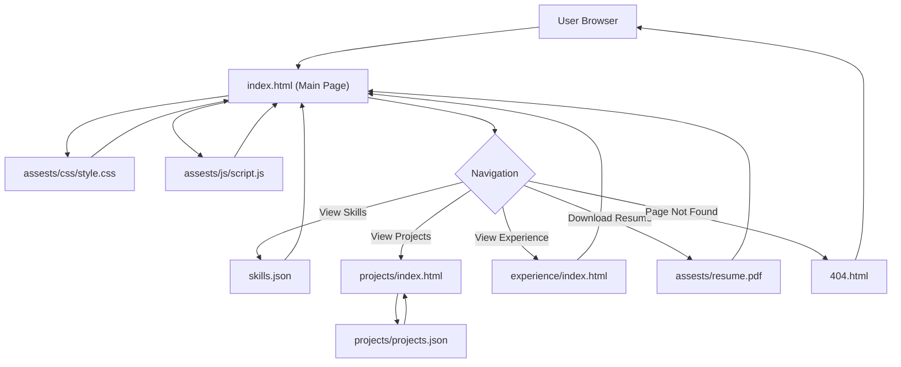

# 🚀 Dynamic Personal Portfolio Website

<p align="center"></p>

## Short Description
Unleash your professional narrative with this modern, responsive, and highly customizable personal portfolio website template. Designed for developers, designers, and creatives, it provides an elegant platform to showcase your skills, projects, and professional journey with impactful visuals and a dynamic user experience. Built with clean HTML, CSS, and JavaScript, it ensures easy customization and a compelling online presence.

## ✨ Key Features
*   **Dynamic Content Sections:** Seamlessly display your skills and projects, powered by easily editable JSON data (`skills.json`, `projects.json`).
*   **Comprehensive Experience Showcase:** A dedicated section (`experience/index.html`) to articulate your career milestones, roles, and achievements.
*   **Integrated Resume:** Provide visitors with quick and convenient access to a downloadable version of your professional resume (`assests/resume.pdf`).
*   **Stunning Visuals & Responsiveness:** Engage your audience with a modern design, responsive layouts for all devices, and interactive elements, enhanced by `particles.min.js` for captivating animations.
*   **Custom 404 Page:** Maintain brand consistency and user experience with a personalized and engaging error page (`404.html`).
*   **Automated Deployment (CI/CD):** Streamline your workflow with pre-configured GitHub Actions (`.github/workflows/ci-cd.yml`) for efficient and reliable website updates.
*   **Clean, Maintainable Codebase:** A well-structured foundation of HTML, modular CSS, and vanilla JavaScript for straightforward understanding and modification.

## Who is this for?
*   **Aspiring & Experienced Developers:** Looking for a polished, robust, and easily deployable template to highlight their coding prowess and project portfolio.
*   **Creative Professionals:** Designers, artists, and digital marketers seeking a visually appealing platform to exhibit their work and services.
*   **Job Seekers:** Anyone aiming to create a strong, professional online presence that stands out to recruiters and potential collaborators.

## Technology Stack & Architecture
This project is a client-side rendered static website, built using modern web standards for speed, reliability, and ease of deployment.

*   **Frontend:** HTML5, CSS3 (with `style.css`, `404.css`), JavaScript (vanilla JS for interactivity, `app.js`, `script.js`, and `particles.min.js` for visual effects).
*   **Deployment:** GitHub Actions for Continuous Integration/Continuous Deployment (CI/CD) automates the build and deployment process.
*   **Data Management:** Structured JSON files (`skills.json`, `projects.json`) enable easy content updates without touching core HTML.

## 📊 Architecture & Database Schema



## ⚡ Quick Start Guide

Get your stunning portfolio up and running in minutes!

1.  **Clone the Repository:**
    ```bash
    git clone https://github.com/Chiba-kun/portfolio_website.git
    cd portfolio_website
    ```
2.  **Open in Browser:**
    Simply open the `index.html` file in your preferred web browser to view the portfolio locally.
    `file:///path/to/your/cloned/repo/portfolio_website/index.html`
3.  **Customize Your Content:**
    *   Update `skills.json` with your specific technical and soft skills.
    *   Modify `projects/projects.json` to showcase your unique projects.
    *   Replace `assests/resume.pdf` with your most current resume.
    *   Personalize the `index.html`, `experience/index.html`, and `projects/index.html` pages, along with `assests/css/style.css`, to reflect your personal brand and details.
4.  **Deploy (Optional):**
    Leverage the provided `.github/workflows/ci-cd.yml` to easily deploy your customized portfolio to GitHub Pages or another static site hosting service by pushing your changes to the `main` branch.

## 📜 License
This project is licensed under the [MIT License](LICENSE).